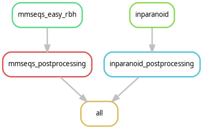

# Orthologue mapping workflow


This repository contains a Snakemake-based workflow for inferring orthologous protein pairs using MMseqs2 (`easy-rbh`) and InParanoid, along with postprocessing steps to classify orthologues by relationship type (1:1, 1:m, n:1, n:m) and identify high-confidence candidates unique to MMseqs2.

## Reproducing the analysis in 5 Steps

### 1. Clone the repository

```bash
git clone https://github.com/ntnn19/orthologue_mapping_snakemake.git
```

---

### 2. Install Singularity (Linux only)

```bash
wget https://github.com/sylabs/singularity/releases/download/v4.2.1/singularity-ce_4.2.1-jammy_amd64.deb
sudo dpkg --install singularity-ce_4.2.1-jammy_amd64.deb
sudo apt-get install -f
```

> 📝 **Note**: If you're running this on a cluster, make sure Singularity is available as a module or installed by your administrator.

---

### 3. Install Micromamba

Run the following command in your terminal to install Micromamba:

```bash
"${SHELL}" <(curl -L micro.mamba.pm/install.sh)
```

Restart your shell or reload your environment (e.g. `exec bash` or `source ~/.bashrc`) if needed.

---

### 4. Set Up the environment

Navigate to the repository (if you're not already there), then create and initialize the environment:

```bash
cd orthologue_mapping_snakemake
micromamba env create -p $PWD/venv -f env.yml
```

---

### 5. Activate the environment and run the workflow

Activate the environment and start the analysis:

```bash
micromamba activate $PWD/venv
./run_workflow.sh
```

> This will run the full pipeline using Snakemake, performing orthology inference and generating postprocessed outputs.
> The evalue for MMSeqs2 can be set in config.yaml.

---

## 📁 Output

The workflow produces:
- Raw and filtered orthologue predictions from MMseqs2 and InParanoid
- Orthotype-labeled results
- A list of MMseqs2-specific orthologues not found in InParanoid

---

## 📫 Questions or Issues?

Please open an issue or contact [ntnn19](https://github.com/ntnn19) for support.
