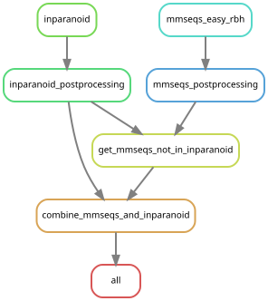

# Orthologue mapping workflow


This repository contains a Snakemake-based workflow for inferring orthologous protein pairs using MMseqs2 (`easy-rbh`) and InParanoid, along with postprocessing steps to classify orthologues by relationship type (1:1, 1:m, n:1, n:m) and identify high-confidence candidates unique to MMseqs2.


## Usage

### Prerequisites: Install Micromamba

Run the following command in your terminal to install Micromamba:

```bash
"${SHELL}" <(curl -L micro.mamba.pm/install.sh)
```

### Prerequisites: Install Singularity

```bash
wget https://github.com/sylabs/singularity/releases/download/v4.2.1/singularity-ce_4.2.1-jammy_amd64.deb
sudo dpkg --install singularity-ce_4.2.1-jammy_amd64.deb
sudo apt-get install -f
```


### 1. Create the environment
```bash
micromamba env create -c conda-forge -c bioconda -c nodefaults --name snakemake snakemake=9.16.3 snakedeploy conda snakemake-executor-plugin-slurm=0.8.0
```

### 2. Activate the environment
```bash
micromamba activate snakemake
```

### 3. Deploy the workflow
```bash
snakedeploy deploy-workflow https://github.com/ntnn19/orthologue_mapping_snakemake . --tag v1.0.1
```

### 4. Run the workflow
```bash
./run_workflow.sh
```


> This will run the full pipeline using Snakemake, performing orthology inference and generating postprocessed outputs.
> The evalue for MMSeqs2 can be set in config.yaml.

---

## 📁 Output

The workflow produces:
- Raw and filtered orthologue predictions from MMseqs2 and InParanoid
- Orthotype-labeled results
- A list of MMseqs2-specific orthologues not found in InParanoid
- A combined list of 1:1 orthologues found only in MMseqs2 or InParanoid

---

## 📫 Questions or Issues?

Please open an issue or contact [ntnn19](https://github.com/ntnn19) for support.


## Authors

- Nathan Nagar (CSSB / LIV)

## References
> Köster, J., Mölder, F., Jablonski, K. P., et al. Sustainable data analysis with Snakemake. F1000Research, 10:33, 2021.

> Flory, C., Virdi, S., Schie, M., Pfister, S., Conze, C., Thünauer, R., ... & Scaturro, P. Multiomics Analysis of Arboviral Capsid Targets in Mosquitoes Reveals a Proviral Function of the Chromatin-Remodeling Brahma Complex. Molecular & Cellular Proteomics, 25(2):, 2026.
